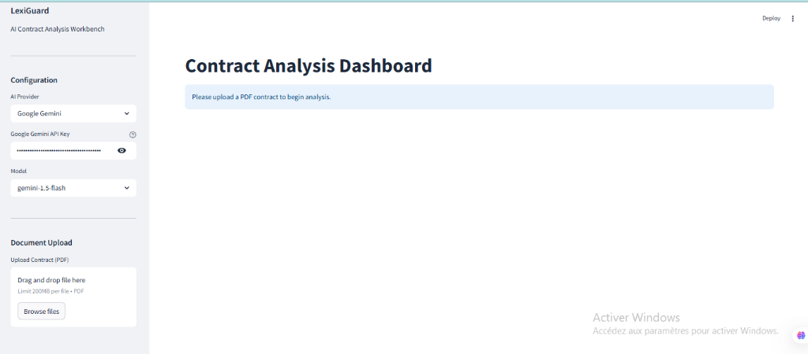
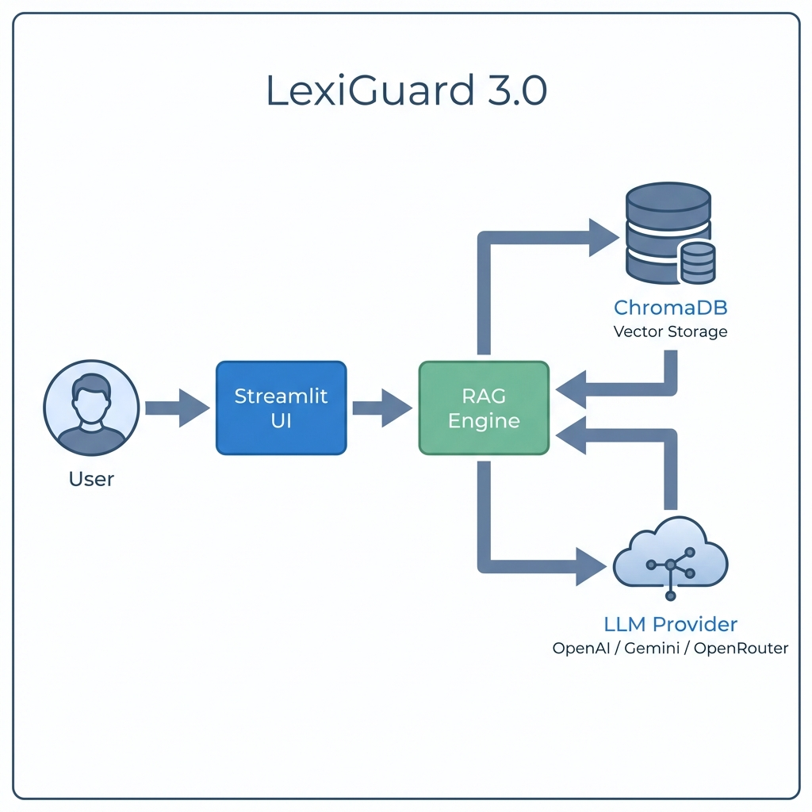

# LexiGuard 3.0

**AI-Powered Contract Analysis Workbench**

LexiGuard is a modern, lightweight tool designed to help legal professionals and developers analyze contracts efficiently. It leverages Retrieval Augmented Generation (RAG) to allow users to chat with their PDF contracts and automatically detect risks.

### User Interface
A clean, distraction-free interface designed for focus.



## Features

*   **Multi-Provider Support**: Choose between OpenAI, Google Gemini, or OpenRouter directly from the UI.
*   **Secure API Key Management**: API Keys are input on the frontend and never stored permanently.
*   **Privacy-First RAG**: Uses local vector storage (ChromaDB) to index documents securey on your machine.
*   **Risk Analysis**: One-click analysis to identify indemnification clauses, termination risks, and liability caps.
*   **Interactive Chat**: Ask precise questions about your specific contract.

## Architecture & Interface

### System Architecture
The application follows a streamlined Python architecture using Streamlit for the frontend and LangChain for the orchestration layer.

**Data Source (Bring Your Own Data)**:
The application does not come with a pre-loaded legal database. It is designed to work with **your specific documents**. When you upload a PDF:
1.  The text is extracted and split into chunks.
2.  Chunks are vectorized (converted to numbers) using the selected AI provider.
3.  Vectors are stored locally in **ChromaDB** (`/chroma_db` folder).
4.  This database grows as you add more contracts.



## Tech Stack

*   **Frontend**: Streamlit (Python)
*   **Orchestration**: LangChain
*   **Vector Database**: ChromaDB (Local)
*   **Embeddings**: OpenAI & Google Generative AI

## Getting Started

### Prerequisites
*   Python 3.10 or higher installed.
*   API Key for OpenAI, Google Gemini, or OpenRouter.

### Installation

1.  **Clone the repository**
    ```bash
    git clone https://github.com/IrieAlberic/lexiguard.git
    cd lexiguard
    ```

2.  **Run the Setup Script (Windows)**
    ```bash
    .\setup_env.bat
    ```
    *Alternatively, manual installation:*
    ```bash
    python -m venv venv
    venv\Scripts\activate
    pip install -r requirements.txt
    ```

3.  **Run the Application**
    ```bash
    .\run_app.bat
    ```
    Or manually:
    ```bash
    streamlit run app.py
    ```

## Usage

1.  Select your **AI Provider** in the sidebar (e.g., Google Gemini).
2.  Enter your **API Key**.
3.  Upload a **PDF Contract**.
4.  Wait for the ingestion notification.
5.  Use the **Chat Assistant** tab to ask questions or **Risk Analysis** tab for automated auditing.

## License

MIT License.
